# Search Typeahead

A fast, self-contained search autocomplete service. As you type a prefix it
returns the most relevant completions in about a millisecond, ranked by both
all-time popularity **and** what's trending right now. Submitting a search feeds
popularity back into the rankings.

The interesting part is the backend data system: how query→count data is stored,
how prefix lookups stay fast under load, how the read cache is distributed with
consistent hashing, and how write pressure is absorbed with batched writes.

- **Backend:** Python + FastAPI
- **Frontend:** plain HTML/CSS/JS, no build step
- **Durable store:** SQLite (WAL mode)
- **Serving structure:** in-memory prefix trie with per-node top-N caching

---

## Features

- **Prefix suggestions** — up to 10 completions for any prefix, sorted by score,
  served from memory in sub-millisecond time.
- **Recency-aware ranking** — a query spiking *now* can outrank a historically
  popular but quiet one, then decays back naturally once the spike passes.
- **Distributed read cache** — multiple logical cache nodes with TTL + LRU,
  routed by a consistent-hashing ring with virtual nodes.
- **Batched writes** — search submissions are buffered, aggregated, and flushed
  to SQLite in the background, collapsing thousands of writes into a handful.
- **Live metrics** — latency percentiles (p50/p95/p99), cache hit rate, and
  database read/write counts exposed at `/metrics`.
- **Usable UI** — debounced input, keyboard navigation, a trending panel, and
  loading/error states.

---

## Quick start

```bash
# Windows — one command (installs deps, builds the dataset, starts the server):
run.bat

# Any OS — manual:
python -m pip install -r requirements.txt
python -m scripts.generate_dataset --rows 120000   # writes data/queries.csv
python -m scripts.ingest                            # loads the CSV into SQLite
python -m uvicorn app.main:app --port 8000
```

Then open <http://127.0.0.1:8000>. Interactive API docs are auto-generated at
<http://127.0.0.1:8000/docs>.

> On first start the trie is rebuilt from SQLite (a few seconds for 120k rows).
> After that, suggestions are served entirely from memory.

---

## Architecture

The system has two paths: a fast **read path** (`GET /suggest`) served from cache
or an in-memory trie, and a **write path** (`POST /search`) that updates rankings
in memory and defers the durable write to a background batch writer.

### Read path — `GET /suggest`

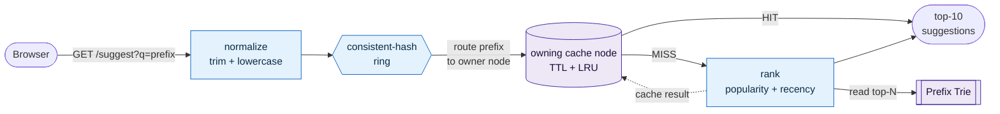

The prefix is routed to exactly one cache node by the ring. A **hit** returns the
precomputed top-10 immediately; a **miss** ranks completions from the trie,
caches the result on that node, and returns it. Empty, missing, mixed-case, and
no-match inputs all return an empty list — never an error.

### Write path — `POST /search`

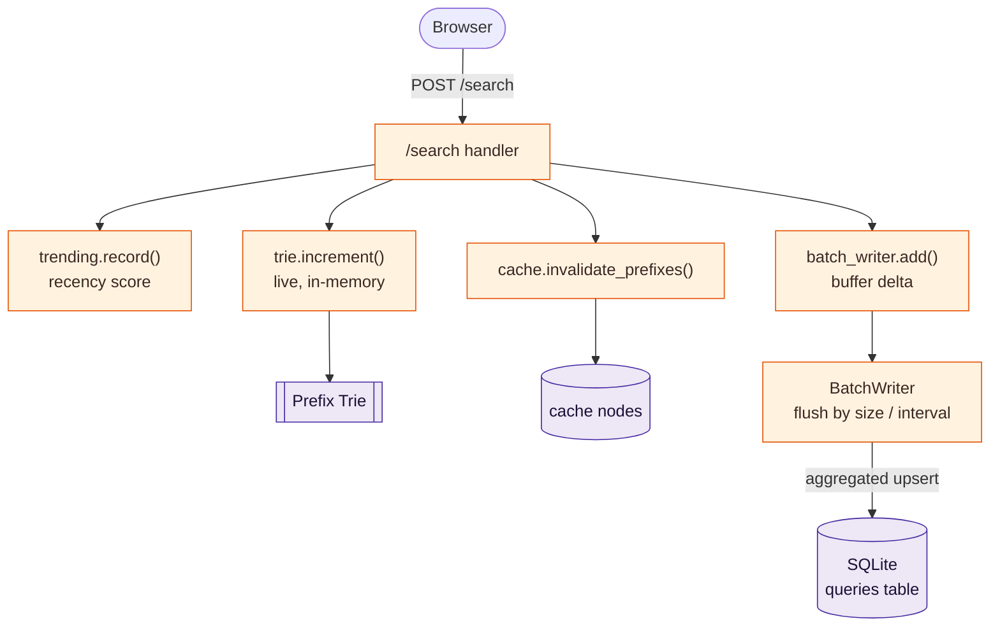

The handler updates the trie *live* (so suggestions are instantly fresh), bumps
the recency score, invalidates the affected cached prefixes, and buffers the
count — the durable SQLite write is batched in the background. It returns
`{"message": "Searched"}`. On startup the trie is rebuilt from SQLite, the
durable source of truth.

**Module map** (`app/`):

| File | Responsibility |
|------|----------------|
| `config.py` | All tunables: cache nodes, virtual nodes, TTL, batch size/interval, decay. |
| `trie.py` | Prefix trie; each node caches its top-N completions by count. |
| `store.py` | SQLite primary store: bulk load + batched upserts. |
| `consistent_hash.py` | Hash ring with virtual nodes — routes prefixes to cache nodes. |
| `cache.py` | Logical cache nodes (TTL + LRU) + ring routing + invalidation. |
| `trending.py` | Time-decayed recency score; recency-aware ranking + trending list. |
| `batch_writer.py` | Buffer → aggregate → flush by size or interval. |
| `metrics.py` | Latency (p50/p95/p99), cache hit rate, DB read/write counts. |
| `main.py` | FastAPI routes; wires everything together. |

For the reasoning behind each of these choices — and the alternatives that were
rejected — see [DESIGN.md](DESIGN.md).

---

## Screenshots

**Typeahead suggestions** — ranked completions for a prefix, served from memory:

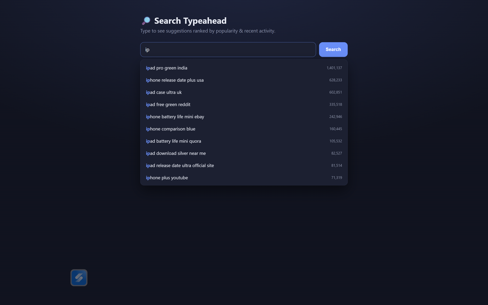

**Recency-aware ranking** — after a query is searched repeatedly, it climbs above
far more popular all-time queries, then decays back once the spike passes. Below,
*iphone plus youtube* (71k all-time) rises to the top of the `iph` results, above
queries with 600k+:

| Before | After repeated searches |
|--------|-------------------------|
| 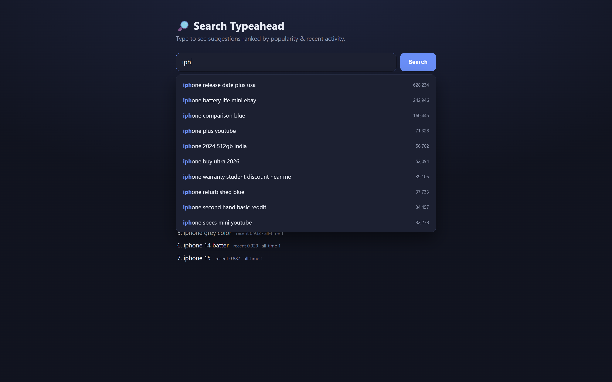 | 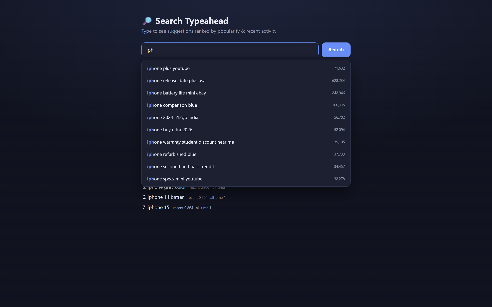 |

**Search response & trending**

| Search response | Trending |
|-----------------|----------|
| 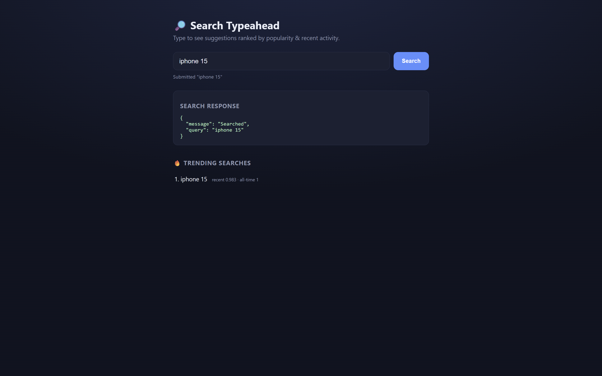 | 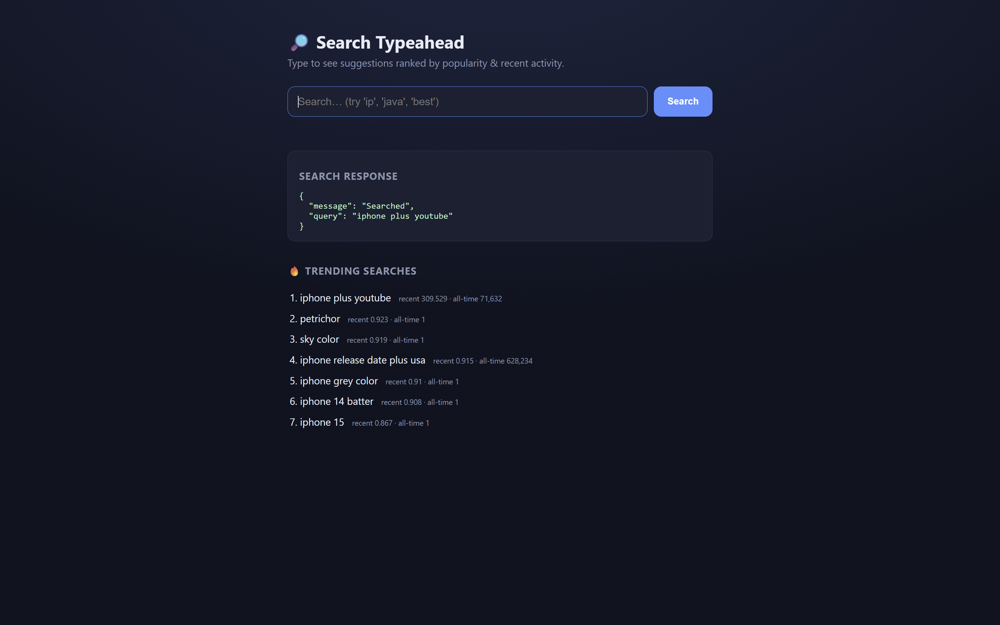 |

**Distributed cache routing (`/cache/debug`)** and **metrics (`/metrics`)**

| Cache routing | Metrics |
|---------------|---------|
| 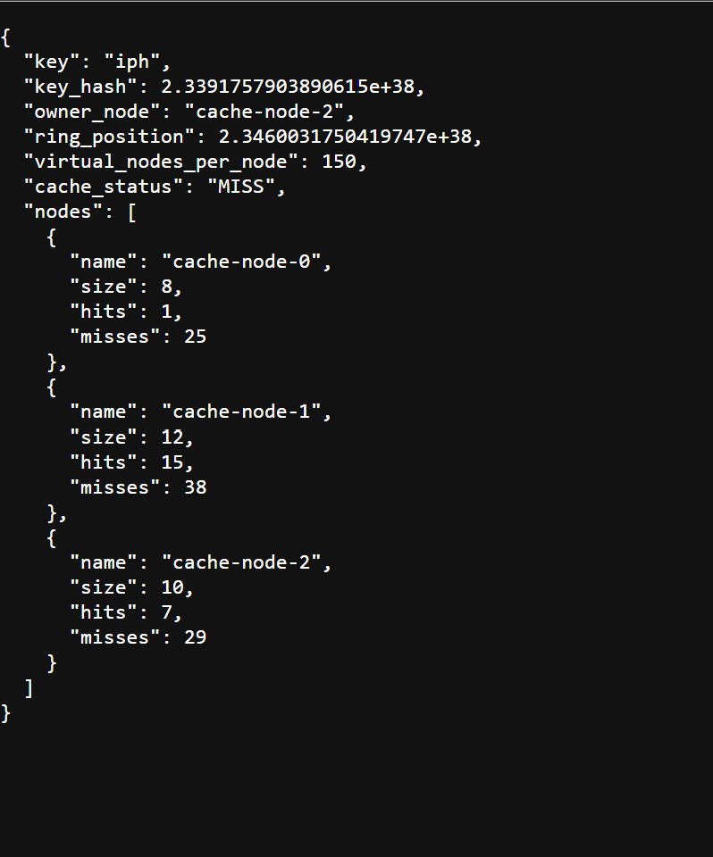 | 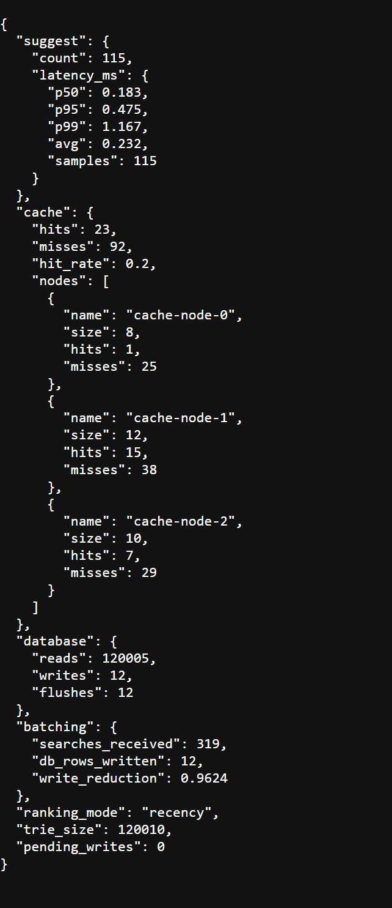 |

**Consistent-hashing distribution & rebalancing** — adding a node remaps ~24% of
keys versus ~73% for naive `hash % N`:

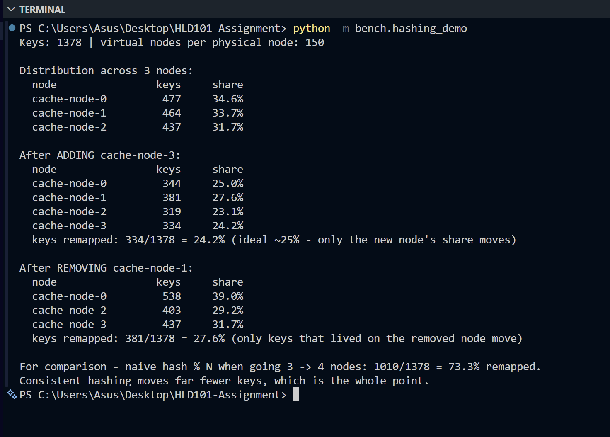

**End-to-end benchmark** — latency, cache hit rate, write reduction, and the
ranking demo:

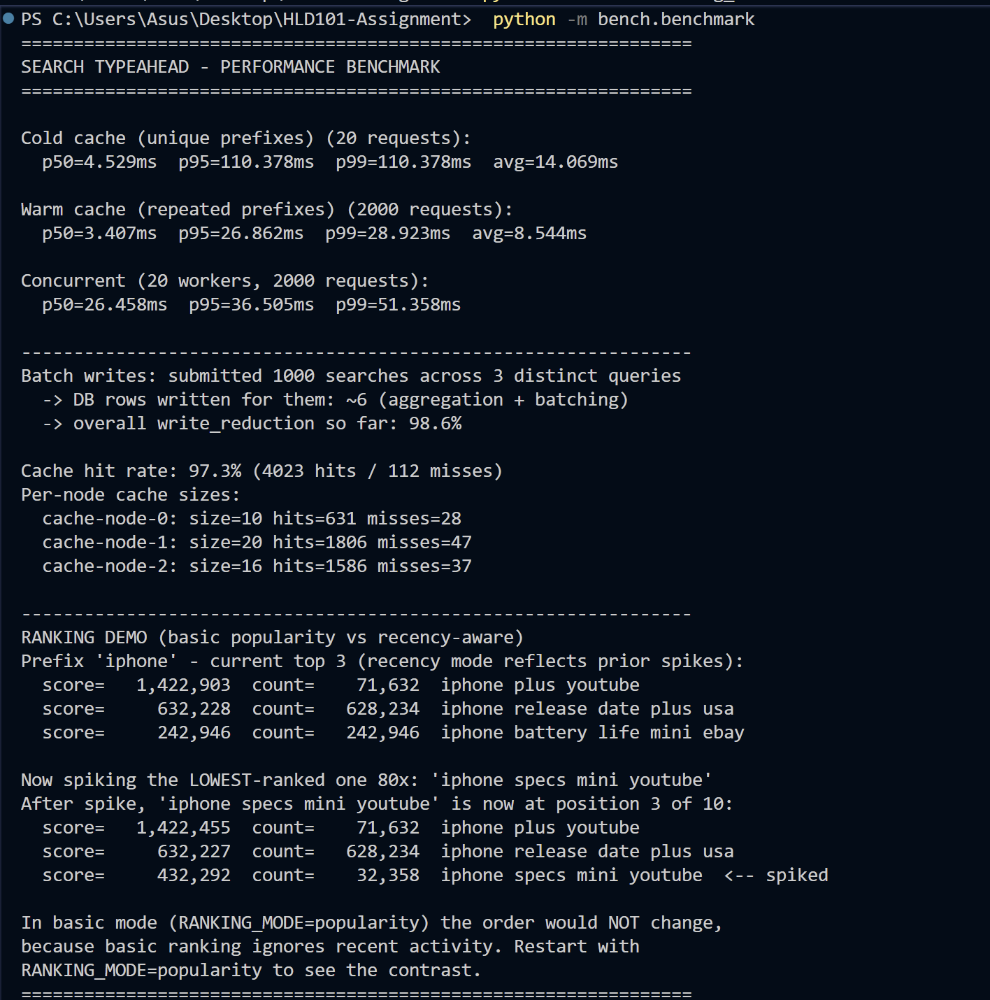

---

## Dataset

Input format is a CSV with a `query,count` header:

| query | count |
|-------|-------|
| iphone | 628233 |
| iphone 15 | 56702 |
| java tutorial | 415001 |

Two sources are supported:

- **Synthetic generator (default, fully offline):**
  `scripts/generate_dataset.py` builds 120,000 distinct, prefix-sharing queries
  with a Zipf-like popularity distribution. This is what `run.bat` uses, so the
  service runs with zero downloads.
  ```bash
  python -m scripts.generate_dataset --rows 120000 --out data/queries.csv
  ```
- **Real data — Wikimedia Pageviews:** public hourly dumps where each line is
  `domain page_title view_count bytes`. Page titles map naturally to queries and
  view counts to popularity. Source: <https://dumps.wikimedia.org/other/pageviews/>
  ```bash
  # download + convert one hourly file:
  python -m scripts.load_dataset --url https://dumps.wikimedia.org/other/pageviews/2024/2024-01/pageviews-20240101-000000.gz
  # or convert an already-downloaded file:
  python -m scripts.load_dataset --file data/pageviews-20240101-000000.gz
  ```

After generating or downloading, load it into SQLite:

```bash
python -m scripts.ingest          # reads data/queries.csv -> data/typeahead.db
```

Data files (`data/*.csv`, `*.db`, `*.gz`) are git-ignored and regenerated by the
commands above, so the repository stays light.

---

## API reference

| Method | Endpoint | Behavior |
|--------|----------|----------|
| `GET` | `/suggest?q=<prefix>` | Up to 10 prefix matches ranked by score. Handles empty/missing/mixed-case/no-match gracefully (returns `[]`). |
| `POST` | `/search` | Body `{"query": "..."}`. Returns `{"message":"Searched"}` and records the query. |
| `GET` | `/cache/debug?prefix=<p>` | Which cache node owns the prefix, its ring position, and current HIT/MISS. |
| `GET` | `/trending` | Current trending queries by decayed recent activity. |
| `GET` | `/metrics` | Latency p50/p95/p99, cache hit rate, DB read/write counts, write reduction. |
| `GET` | `/` , `/docs` | The UI and auto-generated API docs. |

**Examples**

```bash
curl "http://127.0.0.1:8000/suggest?q=ip"
curl -X POST "http://127.0.0.1:8000/search" \
     -H "Content-Type: application/json" -d '{"query":"iphone 15"}'
curl "http://127.0.0.1:8000/cache/debug?prefix=iph"
curl "http://127.0.0.1:8000/metrics"
```

---

## Configuration

Everything tunable lives in `app/config.py`; a few values can be overridden with
environment variables.

| Setting | Default | Meaning |
|---------|---------|---------|
| `MAX_SUGGESTIONS` | 10 | Results returned to the UI. |
| `CANDIDATE_POOL` | 25 | Top-N kept per trie node (gives recency re-ranking room). |
| `CACHE_NODES` | 3 nodes | Logical cache nodes on the ring. |
| `VIRTUAL_NODES` | 150 | Replicas per node on the ring (even distribution). |
| `CACHE_TTL_SECONDS` | 30 | Cache entry expiry. |
| `CACHE_MAX_ENTRIES` | 5000 | Per-node LRU cap. |
| `BATCH_SIZE` | 200 | Flush once this many distinct queries are buffered… |
| `BATCH_INTERVAL_SECONDS` | 5 | …or this many seconds pass, whichever first. |
| `RANKING_MODE` | `recency` | `recency` (popularity + recent activity) or `popularity` (all-time only). |
| `RECENCY_HALF_LIFE_SECONDS` | 1800 | A query's recent score halves every 30 min. |
| `RECENCY_BOOST` | 5000 | Converts one decayed recent search into "equivalent all-time counts". |

Switch to pure popularity ranking at startup:

```bash
RANKING_MODE=popularity python -m uvicorn app.main:app --port 8000
```

---

## Performance

Measured locally (Windows, Python 3.13) on the synthetic 120k-query dataset.
Reproduce with `python -m bench.benchmark` and `python -m bench.hashing_demo`.

**Suggestion latency**

| Metric | Server-side (handler only, from `/metrics`) | Client-observed warm (HTTP round-trip) |
|--------|---------------------------------------------|----------------------------------------|
| p50 | ~0.18 ms | ~3.4 ms |
| p95 | **~0.48 ms** | ~26.9 ms |
| p99 | ~1.17 ms | ~28.9 ms |

Server-side handler time is the actual cache/trie speed. The client figure
includes per-request HTTP connection setup over localhost (the benchmark opens a
fresh connection each call) and is not the data-system latency.

- **Cache hit rate:** ~97% under a realistic repeated-prefix workload
  (4023 hits / 112 misses in one benchmark run).
- **Write reduction:** 1000 searches across 3 distinct queries → ~6 rows
  written → ~98.6% fewer writes than one-write-per-search. Reported live at
  `/metrics`.
- **Consistent hashing:** 1378 prefix keys spread ~34.6/33.7/31.7% over 3 nodes.
  Adding a 4th node remaps ~24.2% of keys (ideal ~25%); naive `hash % N` over the
  same change remaps ~73.3%.

---

## Benchmarks and demos

```bash
# Consistent-hashing distribution + rebalancing (no server needed):
python -m bench.hashing_demo

# End-to-end latency, cache hit rate, write reduction, ranking demo
# (start the server first):
python -m bench.benchmark
```

The ranking demo takes the lowest-ranked completion for a prefix, searches it
repeatedly, and shows it climb the list under recency ranking — then notes that
in `popularity` mode the order would not change.

---

## Project layout

```
app/          backend modules (see module map above)
scripts/      generate_dataset.py · load_dataset.py · ingest.py
static/       index.html · app.js · style.css   (the UI)
bench/        benchmark.py · hashing_demo.py
data/         dataset CSV + SQLite db (git-ignored, regenerated)
```

---

## Design notes

Every component here is a deliberate response to one tension: serve prefix reads
in ~1 ms while continuously absorbing writes, without the writes wrecking read
latency or freshness. The full reasoning — why a trie, why in-process cache
nodes instead of Redis, how the decay math avoids permanently over-ranking a
fad, and the batch-write durability trade-off — is in [DESIGN.md](DESIGN.md).
