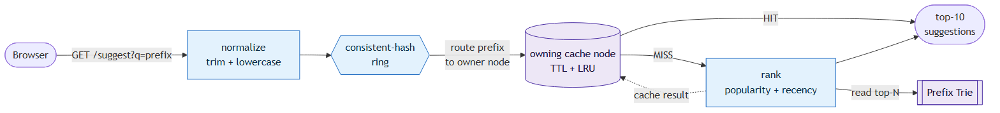
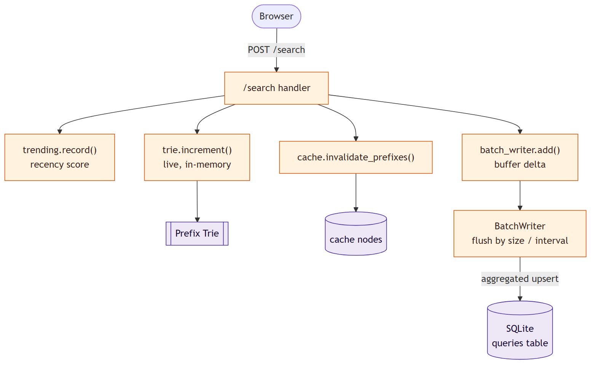

# Search Typeahead — Project Report

A fast search autocomplete service. As the user types a prefix it returns the
most relevant completions in about a millisecond, ranked by both all-time
popularity **and** recent activity. Submitting a search feeds popularity back
into the rankings.

- **Backend:** Python + FastAPI
- **Frontend:** plain HTML/CSS/JS (no build step)
- **Durable store:** SQLite (WAL mode)
- **Serving structure:** in-memory prefix trie with per-node top-N caching
- **Read cache:** multiple logical nodes routed by a consistent-hashing ring

---

## 1. Architecture

The system has two paths: a fast **read path** (`GET /suggest`) served from a
distributed cache or an in-memory trie, and a **write path** (`POST /search`)
that updates rankings in memory and defers the durable write to a background
batch writer.

### Read path — `GET /suggest`



The prefix is normalized (trim + lowercase) and routed to exactly one cache node
by the consistent-hash ring. A **hit** returns the precomputed top-10 list
immediately; a **miss** ranks completions from the trie, stores the result on
that node, and returns it. Empty, missing, mixed-case, and no-match inputs all
return an empty list — never an error.

### Write path — `POST /search`



The `/search` handler updates the trie **live** (so suggestions are instantly
fresh), bumps the recency score, invalidates the affected cached prefixes, and
buffers the count delta. The durable SQLite write is **batched** in the
background. It returns `{"message": "Searched"}`. On startup the trie is rebuilt
from SQLite, which is the durable source of truth.

### Module map

| File | Responsibility |
|------|----------------|
| `config.py` | All tunables: cache nodes, virtual nodes, TTL, batch size/interval, decay. |
| `trie.py` | Prefix trie; each node caches its top-N completions by count. |
| `store.py` | SQLite primary store: bulk load + batched upserts. |
| `consistent_hash.py` | Hash ring with virtual nodes — routes prefixes to cache nodes. |
| `cache.py` | Logical cache nodes (TTL + LRU) + ring routing + invalidation. |
| `trending.py` | Time-decayed recency score; recency-aware ranking + trending list. |
| `batch_writer.py` | Buffer → aggregate → flush by size or interval. |
| `metrics.py` | Latency (p50/p95/p99), cache hit rate, DB read/write counts. |
| `main.py` | FastAPI routes; wires everything together. |

---

## 2. Dataset — source and loading instructions

Input format is a CSV with a `query,count` header:

| query | count |
|-------|-------|
| iphone | 628233 |
| iphone 15 | 56702 |
| java tutorial | 415001 |

Two sources are supported. Both exceed the 100,000-row minimum; the working
dataset used for this report has **120,000** distinct queries.

**A. Synthetic generator (default, fully offline)** — builds 120,000 distinct,
prefix-sharing queries with a Zipf-like popularity distribution:

```bash
python -m scripts.generate_dataset --rows 120000 --out data/queries.csv
```

**B. Real data — Wikimedia Pageviews** — public hourly dumps where each line is
`domain page_title view_count bytes`. Page titles map naturally to queries and
view counts to popularity. Source: <https://dumps.wikimedia.org/other/pageviews/>

```bash
# download + convert one hourly file:
python -m scripts.load_dataset --url https://dumps.wikimedia.org/other/pageviews/2024/2024-01/pageviews-20240101-000000.gz
# or convert an already-downloaded file:
python -m scripts.load_dataset --file data/pageviews-20240101-000000.gz
```

**Loading into SQLite** (either source produces `data/queries.csv`):

```bash
python -m scripts.ingest          # reads data/queries.csv -> data/typeahead.db
```

**Running the whole thing:**

```bash
# Windows — one command (installs deps, builds the dataset, starts the server):
run.bat

# Any OS — manual:
python -m pip install -r requirements.txt
python -m scripts.generate_dataset --rows 120000
python -m scripts.ingest
python -m uvicorn app.main:app --port 8000
```

Then open <http://127.0.0.1:8000>. Interactive API docs are at `/docs`.

---

## 3. API documentation

| Method | Endpoint | Behavior |
|--------|----------|----------|
| `GET` | `/suggest?q=<prefix>` | Up to 10 prefix matches ranked by score. Handles empty/missing/mixed-case/no-match gracefully (returns `[]`). |
| `POST` | `/search` | Body `{"query": "..."}`. Returns `{"message":"Searched"}` and records the query. |
| `GET` | `/cache/debug?prefix=<p>` | Which cache node owns the prefix, its ring position, and current HIT/MISS. |
| `GET` | `/trending` | Current trending queries by decayed recent activity. |
| `GET` | `/metrics` | Latency p50/p95/p99, cache hit rate, DB read/write counts, write reduction. |
| `GET` | `/` , `/docs` | The UI and auto-generated API docs. |

**Examples**

```bash
curl "http://127.0.0.1:8000/suggest?q=ip"
curl -X POST "http://127.0.0.1:8000/search" \
     -H "Content-Type: application/json" -d '{"query":"iphone 15"}'
curl "http://127.0.0.1:8000/cache/debug?prefix=iph"
curl "http://127.0.0.1:8000/metrics"
```

**Sample response — `GET /suggest?q=ip`**

```json
{
  "query": "ip",
  "suggestions": [
    {"query": "ipad pro green india", "count": 1401137, "score": 1401137.0},
    {"query": "iphone release date plus usa", "count": 628233, "score": 628233.0}
  ],
  "source": "cache"
}
```

---

## 4. Design choices and trade-offs

### The core tension
A typeahead service has two workloads that pull against each other. **Reads**
(`/suggest`) happen on nearly every keystroke and must be single-digit
milliseconds. **Writes** (`/search`) mutate the popularity counts that reads
depend on — done naively, every search is a disk write *and* a cache
invalidation, which degrades read latency exactly when traffic spikes. Every
decision below is an answer to this tension.

### Storage — SQLite + an in-memory trie
- **SQLite** (WAL mode) is the durable source of truth: zero setup, single file,
  transactional, ships with Python. The access pattern is a keyed upsert plus a
  full scan on startup — nothing that needs a server-based RDBMS.
  *Rejected:* Postgres/MySQL (operational overhead, no payoff at this scale);
  Redis-only (trades the durability we want for speed the trie already provides).
- **Prefix trie** is the in-memory serving structure. A trie reaches a prefix in
  `O(len(prefix))` regardless of dataset size, and **each node caches its top-N
  completions by count**, so serving a prefix is "walk to the node, read its
  list" — no subtree scan or sort at request time.
  *Rejected:* scan + sort per request (too slow on short, popular prefixes);
  precompute every prefix into a hash map (huge memory, expensive rebuild on
  writes); SQL `LIKE 'prefix%'` (every read hits disk).
- *Trade-off:* the working set lives in RAM and the trie is rebuilt from SQLite
  on startup. The trie is a fast, rebuildable cache of the durable store —
  losing it costs a few seconds of startup, not data.

### Distributed cache + consistent hashing
- The read path checks the cache **before** the trie. A cached value is the
  fully-formed top-10 list for a prefix, so a hot prefix is an O(1) lookup.
- The cache is split across multiple **logical nodes**, each an independent
  **TTL + LRU** map, with a **consistent-hashing ring** deciding which node owns
  a prefix. The routing logic is identical to a real multi-server cache — only
  the transport (a function call vs a network hop) differs, so a node could be
  swapped for Redis without touching the ring.
- **Consistent hashing with virtual nodes (150/node):** plain `hash(key) % N`
  remaps almost every key when the node count changes (~73% in testing);
  consistent hashing only moves ~`1/N` (~24%). For a cache, "remapped" means
  "cold miss", so modulo hashing would wipe the cache on any topology change.
  Virtual nodes even out the otherwise-lumpy distribution.
- **Freshness — TTL *and* invalidation:** every entry expires after 30 s
  (bounds staleness), and a search additionally invalidates the cached lists for
  every prefix of the changed query (immediate freshness on change).

### Recency-aware ranking (trending)
- Each query keeps a single **time-decayed score**. A search adds `1.0` after
  first decaying the old value by elapsed time:
  `decay = exp(-lambda · t)`, `lambda = ln(2) / half_life` (half-life 30 min).
  *Rejected:* fixed time-window buckets (need per-event timestamps or rotating
  buckets + cleanup; drop off a cliff at the window edge). One float per query,
  updated in O(1), with a smooth fade, is cheaper and simpler.
- **Combined score:** `effective = all_time_count + RECENCY_BOOST · recent_score`.
  `RECENCY_BOOST` converts recent activity into "equivalent all-time counts" so
  the two live on one scale and can be added.
- **No permanent over-ranking:** the recent score decays continuously toward 0,
  so a spike fades back to its all-time rank within a few half-lives once
  searches stop. The same `/suggest` endpoint serves both modes via a
  `RANKING_MODE` flag (`popularity` vs `recency`).
- *Trade-off:* a single decayed score is approximate (it can't give exact
  windowed counts), but for ranking, approximate-but-cheap is the right call.

### Batch writes
- `/search` never writes to SQLite synchronously. It increments the trie in
  memory and **buffers** the count delta. A background thread flushes when the
  buffer reaches `BATCH_SIZE` (200 distinct queries) **or** every
  `BATCH_INTERVAL_SECONDS` (5 s), whichever comes first.
- **Aggregation:** repeated searches for the same query collapse into a single
  `+N` upsert (1000 searches for "iphone" → one row write, not 1000).
- **Failure trade-off:** the buffer is in memory, so a crash between flushes
  loses the un-flushed deltas — the durable count lags by at most one batch.
  Accepted because the data is popularity counters (a few lost increments are
  harmless) and exposure is bounded by the short interval plus flush-on-shutdown.
  A write-ahead log would make it durable at the cost of complexity.

---

## 5. Performance report

Measured locally (Windows, Python 3.13) on the synthetic 120,000-query dataset.
Reproduce with `python -m bench.benchmark` and `python -m bench.hashing_demo`.

### Suggestion latency

| Metric | Server-side (handler only) | Client-observed warm (HTTP round-trip) |
|--------|----------------------------|----------------------------------------|
| p50 | ~0.18 ms | ~3.4 ms |
| p95 | **~0.48 ms** | ~26.9 ms |
| p99 | ~1.17 ms | ~28.9 ms |

Server-side handler time is the actual cache/trie speed. The client figure
includes per-request HTTP connection setup over localhost and is not the
data-system latency.

### Cache hit rate, write reduction, and hashing

- **Cache hit rate:** ~97% under a realistic repeated-prefix workload
  (4023 hits / 112 misses in one benchmark run).
- **Write reduction:** 1000 searches across 3 distinct queries → ~6 rows
  written → **~98.6% fewer writes** than one-write-per-search.
- **Consistent hashing:** 1378 prefix keys spread ~34.6/33.7/31.7% over 3 nodes.
  Adding a 4th node remaps ~24.2% of keys (ideal ~25%); naive `hash % N` over the
  same change remaps ~73.3%.

### Evidence

**Live metrics (`/metrics`)** — latency percentiles, hit rate, write reduction:


**End-to-end benchmark** — latency, hit rate, write reduction, ranking demo:


**Consistent-hashing distribution and rebalancing** (vs naive modulo):


**Recency-aware ranking** — after repeated searches, *iphone plus youtube*
(71k all-time) rises to the top of the `iph` results, above queries with 600k+,
then decays back once the spike passes:

| Before | After repeated searches |
|--------|-------------------------|
|  |  |

**Cache routing (`/cache/debug`)** — which node owns a prefix, ring position,
HIT/MISS:


**Typeahead suggestions UI:**


